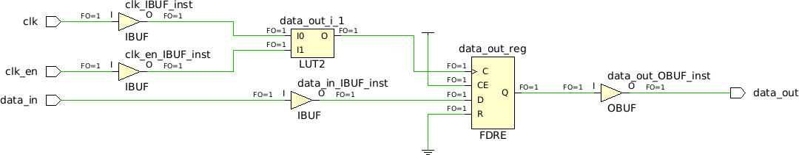
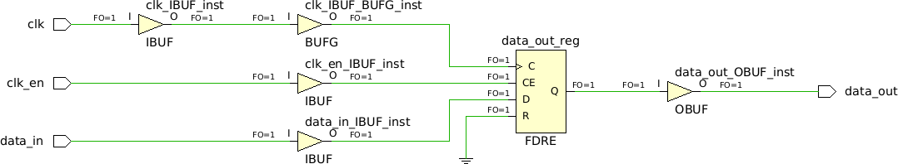

# Automatic Gated Clock Conversion

If an ASIC design contains clock gating constructs that are needed to work (if not, replace them with a wire), there are synthesis tools that can rewrite gates in the clock path as clock enable in the data path.

Requisists:
* You must have constructs in the form of `assign clk_gated = clk & clk_en;` (Verilog) or `clk_gated <= clk and clk_en;` (VHDL).
* `clk_gated` must be used as the clock of an `always`/`process`.
* **ATTENTION**: The gated clock must be specified as a clock with a `create_clock` constraint.
* `-gated_clock_conversion` must be enabled:
  * GUI: Settings -> Synthesis -> select `on` or `auto`
  * Tcl Console: `set_property STEPS.SYNTH_DESIGN.ARGS.GATED_CLOCK_CONVERSION auto [get_runs synth_1]`

> **NOTES:**
> * AND is one of the most common forms of gated clocks, but Vivado also supports other constructs such as OR, registered gates, and clock dividers.
> * `auto` converts all the found constructs, while `on` needs the addition of an attribute in the clock signals to be converted (`(* gated_clock = "yes" *) input clk;`).

Example code [here](top.v).

Before "Automatic Gated Clock conversion":

After "Automatic Gated Clock conversion":

Drawbacks:
* More clock enables implies more control sets, which can be a problem.
* Depending on the gated clock implementation, you could have differences between simulation and synthesis code.
