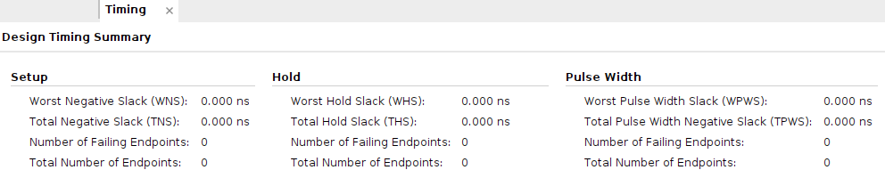

# Timing closure

Writing timing constraints and validating the design against those, is commonly referred to as
timing closure, which is essential to ensure that a design works reliably given process, voltage,
and temperature variations over time.

> **Reference resources:**
> * [A Methodology for Repeatable and Reliable Timing Closure (WP480)](https://docs.xilinx.com/v/u/en-US/wp480-timing-closure-methodology)

## Evaluating results quality

When resource utilization increases, the difficulty of closing timing also increases.
It is important to review utilization for LUT, FF, BRAM, and DSP, taking into account that designs
with high utilization of at least one of them, might experience P&R difficulties.

To achieve timing closure, 3 conditions must be met:
* Worst negative setup slack (WNS) must be >= 0
* Worst hold slack (WHS) must be >= 0
* Worst pulse width switching slack (WPWS) must be >= 0

PWS violations are physical limitations of the device (for example, max. frequency), and are
typically caused by user definition mistakes.
Designs with hold violations do not work regardless of how slow they operate.
These are generally solved by P&R, adding routing delay.
Closing the setup timing is generally the most difficult part.

The total negative setup slack (TNS) represents the sum of all WNS violations for each timing
endpoint. Vivado optimizes designs to improve the WNS, not the TNS, but this is reduced as the
worst paths are resolved. However, the TNS order of magnitude gives an indication of how close a
design is to timing closure:

| WNS (ps)      | TNS (ns)       | Quality   |
| :---:         | :---:          | :---:     |
| +100 to -100  | 0 to -10       | Excellent |
| -100 to -300  | -10 to -100    | Good      |
| -300 to -600  | -100 to -1000  | Fair      |
| -600 and less | -1000 and less | Poor      |

Ideally, a synthesized design should have the setup timing closed.
Designers should iterate by modifying RTL, timing constraints, and/or tool options to close WNS
before P&R (it is much more efficient and a better utilization of the designer's time).
The higher the quality, the more likely the tools are to deliver better performance on a consistent
basis.

The timing results after the placement are particularly important because the route estimates are
much more realistic.
Designers should iterate on this task while identifying potential RTL improvements, timing
constraints, placement constraints, and tool options to close the setup timing.
The closer WNS/TNS values are to the good/excellent range, the easier and more stable the timing
closure task becomes.
