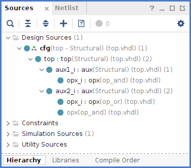
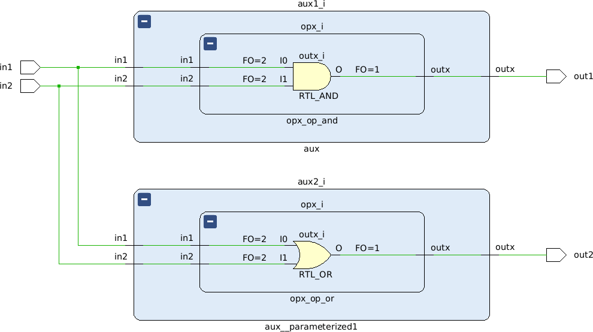

# VHDL Configuration

A configuration is employed to specify the architecture to be used by one/all the instance/s of an entity in a design.

Syntax:
```vhdl
configuration CONFIG_NAME of ENTITY_NAME is
  for ARCH_NAME
    for INSTANCE_LABEL:COMPONENT_NAME
      use entity LIB_NAME.ENTITY_NAME(ARCH_NAME);
    end for;
    for INSTANCE_LABEL:COMPONENT_NAME
      use configuration LIB_NAME.CONFIG_NAME;
    end for;
    -- other for clauses
  end for;
end [configuration] [CONFIG_NAME];
```

Example code [here](top.vhdl).

The applied configuration can be appreciated under the Design Sources, as well as the replaced entity



After the elaboration, you can appreciate how the second AND cell was replaced by an OR cell

