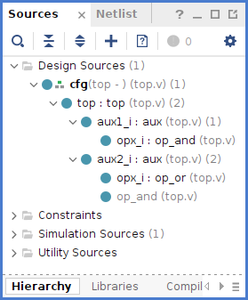
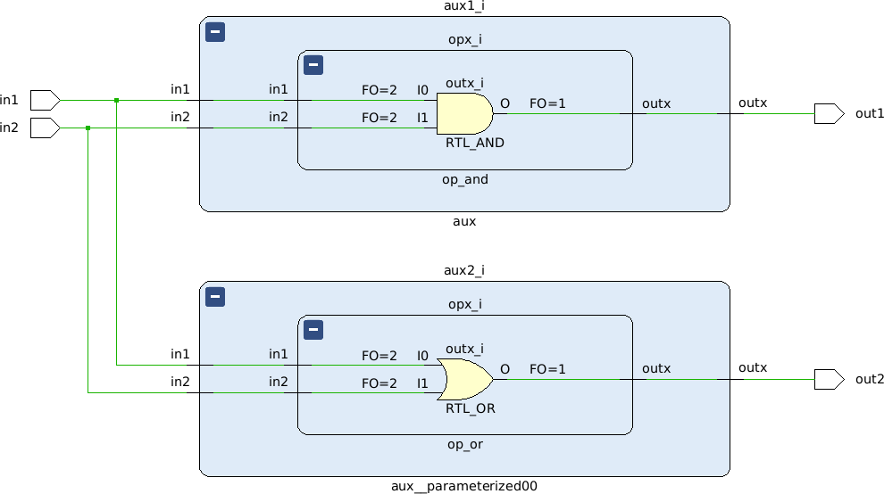

# Verilog Configuration

A configuration is employed to specify the source description to be used by one/all the instance/s of a module in a design.

```verilog
config cfg;
  design top;                     // top-level
  instance top.aux2.mod use mod2; // use cell to replace all the instances
endconfig

module top (
  input  in1,
  input  in2,
  output out1,
  output out2
);

  aux aux1 (.in1(in1), .in2(in2), .out(out1));
  aux aux2 (.in1(in1), .in2(in2), .out(out2));

endmodule

module aux (input in1, input in2, output out);

  mod1 mod (.in1(in1), .in2(in2), .out(out));

endmodule

module mod1 (input in1, input in2, output out);

  assign out = in1 & in2;

endmodule

module mod2 (input in1, input in2, output out);

  assign out = in1 | in2;

endmodule
```

The applied configuration can be appreciated under the Design Sources, as well as the replaced module


After the elaboration, you can appreciate how the second AND gate was replaced by an OR gate

